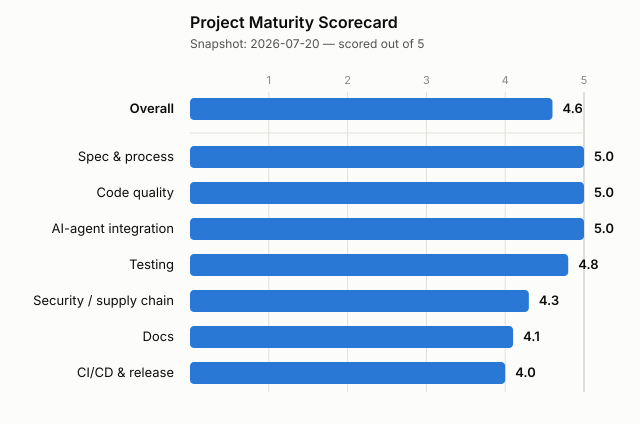

# Project Maturity Scorecard

A **computed**, dated record of this project's engineering and AI-agent-integration
maturity — so improvements (and regressions) are visible over time instead of
living in chat history or someone's judgement.

Every score is produced by [`scripts/maturity-score.mjs`](scripts/maturity-score.mjs)
from **observable facts** in the repository (coverage numbers, workflow config,
the traceability matrix, file presence, lint output) — never a hand-set number.
Each dimension is a weighted list of checks; its score is
`5 × (points earned / points possible)`, and the overall score is the mean of
the dimensions. The machine-readable result, including the per-check breakdown,
is committed as [`maturity-score.json`](maturity-score.json).

> This is a **self-relative** rubric: it tracks *this repo's* trend, and is not a
> certification you can compare against another project's number. Where an
> external standard exists and fits (SHA-pinned actions, presence of
> CodeQL/OpenSSF Scorecard/SLSA, coverage percentages) the check reads that
> signal directly; where none does (AI-agent integration) it is an explicit
> presence checklist, documented below, not a vibe.

**Snapshot: 2026-07-04**

<picture>
  <source media="(prefers-color-scheme: dark)" srcset="docs/public/maturity-scorecard-dark.svg">
  <source media="(prefers-color-scheme: light)" srcset="docs/public/maturity-scorecard-light.svg">
  
</picture>

Regenerate both the JSON and the chart with **`npm run maturity`** (run
`npm test` first so the Testing dimension can read fresh coverage). CI runs
`npm run maturity:check`, which fails if the committed `maturity-score.json` is
stale — so the chart can never drift from reality.

## The rubric — what each dimension measures

Weights are points; a dimension's checks sum to its "possible" column. Numeric
checks (coverage, lint warnings, pin ratio) earn a fraction of their points
against the target shown.

| Dimension | Checks (points) |
|---|---|
| **Spec & process** | `check:traceability` passes (4) · zero untracked requirements (2) · the verify gate runs traceability (2) · constitution present (1) · ≥ 10 spec files (1) |
| **Testing** | branch coverage vs 95% (3) · line coverage vs 95% (2) · function coverage vs 95% (1) · mutation `break` threshold set (2) · low coverage-exclusion ratio (2) |
| **Security / supply chain** | CodeQL workflow (2) · OpenSSF Scorecard workflow (2) · Dependabot (1) · SLSA/provenance/attestation in a workflow (2) · GitHub Actions pinned to a full SHA, as a ratio (3) |
| **CI/CD & release** | CI workflow present (1) · no `continue-on-error` job (2) · release-please (2) · commitlint + commit-msg hook (2) · pre-commit hook runs verify (2) · knip runs in CI (1) |
| **Docs** | README (1) · CONTRIBUTING (1) · CODE_OF_CONDUCT (1) · SECURITY (1) · LICENSE (1) · docs site (1) · guide-page-to-feature ratio (3) · MATURITY.md (1) |
| **Code quality** | TS strict (2) · zero lint errors (2) · lint warnings vs a 200 ceiling (3) · knip clean (2) · bundler configured (1) |
| **AI-agent integration** | AGENTS.md (1) · CLAUDE.md imports it (1) · spec-prompt hook (1) · pre-commit agent hook (1) · coverage agent hook (1) · session bootstrap script + hook (1) · permissions allowlist (1) · `.mcp.json` (1) · PR template asks for requirement IDs (1) · machine-readable build state (1) |

The two dimensions currently below 4.5 are **Docs** (guide pages cover 4 of 11
feature specs — the ratio check is the drag) and **Code quality** (≈130 tolerated
ESLint warnings against the 200 ceiling). Both are honest, mechanical signals: to
move them, write more guide pages or clear lint warnings, and the score follows on
the next `npm run maturity`.

## Known limitations of the current metrics

- **Security reads *presence*, not the live OpenSSF Scorecard number.** Presence
  of CodeQL/Scorecard/SLSA is deterministic and offline; the actual Scorecard
  grade (0–10) requires the securityscorecards.dev API and isn't reproducible in
  a sandbox. A future revision could plug the real grade in behind an env var.
- **Mutation quality isn't scored, only its `break` threshold.** The threshold
  `60` in `stryker.config.json` was set from the tool's pre-existing "low" bound,
  not a measured run (a full Stryker pass is expensive). The score credits that a
  gate *exists*, not that the suite hits a specific mutation score.
- **"Coverage vs 95%" and "warnings vs 200" targets are chosen, not derived.**
  They're transparent knobs in `maturity-score.mjs`; adjust them there if the
  team picks different targets, and the History note should say so.

## History

- **2026-07-04 (morning)** — Baseline assessment (by hand at this point): 4.2/5
  engineering, 4/5 AI-integration. Identified gaps: no spec-checking prompt hook,
  no NFR coverage for reliability/privacy/performance budgets, no session
  bootstrap, no permission allowlist, undocumented footguns, `break: null`
  mutation testing, non-blocking knip, no PR template, no portable MCP config,
  8 files excluded from coverage for being "VS Code-adjacent" without checking.
- **2026-07-04 (midday)** — Added the `UserPromptSubmit` spec-gate hook;
  `S03-performance.md` got concrete timeout/latency budgets; new
  `S04-reliability.md` and `S05-privacy.md` specs; `npm run verify` now runs
  `check:traceability`.
- **2026-07-04 (afternoon)** — Implemented configurable timeouts, offline
  stale-cache fallback, and a pure-JS fallback renderer; added
  `S06-accessibility.md`; re-synced the constitution's Article IV table.
  Backfilled all 150 previously-`untracked` requirements to `implemented`/`manual`.
- **2026-07-04 (evening)** — Session bootstrap script + `SessionStart` hook;
  permissions allowlist; footgun docs in `AGENTS.md`.
- **2026-07-04 (night)** — knip CI job made blocking; Stryker `break` threshold
  set; PR template requiring requirement IDs; `.mcp.json`; brought 5 formerly
  "VS Code-adjacent" classes into full coverage, cutting the exclusion list from
  8 files to 3; hand-scored scorecard + chart added.
- **2026-07-04 (late)** — Replaced the hand-scored table with an **automated
  scorer** (`scripts/maturity-score.mjs`): every dimension is now computed from
  observable facts and committed to `maturity-score.json`, the chart renders from
  that JSON, and `npm run maturity:check` gates drift in CI. First computed
  snapshot: overall **4.7** (Spec & process 5.0, CI/CD 5.0, AI-agent 5.0,
  Security 4.9, Testing 4.7, Docs 4.0, Code quality 4.0).

## Maintaining this file

The scores maintain themselves — `npm run maturity` recomputes `maturity-score.json`
and both chart SVGs from the current repo state. Don't hand-edit scores; change
the *checks or targets* in `scripts/maturity-score.mjs` if the rubric should
change, and add a History entry explaining why. Append to History rather than
rewriting it; the snapshot date and the prose in "The rubric" / "Known
limitations" are the only parts edited in place.
