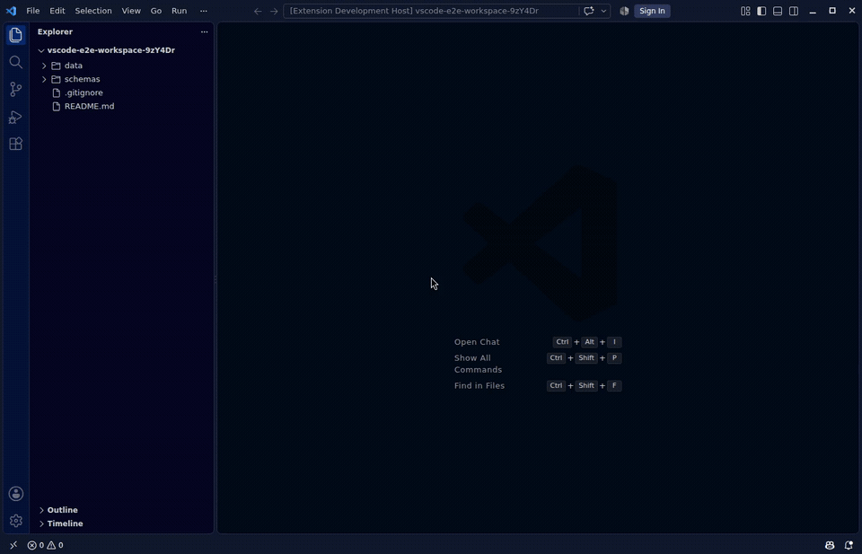

<div align="center">


# JSON Schema Preview

**Read, validate and refactor JSON Schemas — including private ones — without leaving VS Code.**

[](https://marketplace.visualstudio.com/items?itemName=samdidos.json-schema-preview)
[](https://marketplace.visualstudio.com/items?itemName=samdidos.json-schema-preview)
[](https://marketplace.visualstudio.com/items?itemName=samdidos.json-schema-preview&ssr=false#review-details)
[](https://github.com/samdidos/vscode-json-schema-preview/actions/workflows/ci.yml)
[](https://github.com/samdidos/vscode-json-schema-preview/actions/workflows/ci.yml)
[](https://securityscorecards.dev/viewer/?uri=github.com/samdidos/vscode-json-schema-preview)
[](https://github.com/samdidos/vscode-json-schema-preview/blob/main/LICENSE.md)

[**Install**](https://marketplace.visualstudio.com/items?itemName=samdidos.json-schema-preview) ·
[**Documentation**](https://samdidos.github.io/vscode-json-schema-preview/) ·
[**Commands**](https://samdidos.github.io/vscode-json-schema-preview/guide/commands) ·
[**CLI**](https://samdidos.github.io/vscode-json-schema-preview/guide/cli) ·
[**Changelog**](CHANGELOG.md)

</div>

---

<!-- spec:F01,F02,F03,F04,F06,F09,F10,F18 -->


<div align="center"><sub>One continuous take: infer a schema from data, preview it, live-edit it, then validate, bind and generate types — all from the editor toolbar.<br>Per-feature demos are on the <a href="https://samdidos.github.io/vscode-json-schema-preview/">documentation site</a>.</sub></div>

---

## Why this and not the built-in JSON support?

VS Code already validates JSON against a schema. This extension is for everything
that starts *after* that:

| | Built-in JSON/YAML support | JSON Schema Preview |
|---|---|---|
| Validate JSON against a schema | ✅ | ✅ |
| Validate **YAML, TOML and JSONL** data | Partly (YAML via a separate extension) | ✅ |
| Schemas behind **authentication** | ❌ red squiggle, no IntelliSense | ✅ GitHub OAuth, Bearer, Basic |
| Read a schema as **documentation** | ❌ | ✅ live preview panel |
| Is this schema change **breaking**? | ❌ | ✅ classified diff + CI gate |
| **Refactor** a schema (extract, inline, rename) | ❌ | ✅ |
| Generate a schema **from data**, or types/data from a schema | ❌ | ✅ |
| **Test** a schema against pinned cases | ❌ | ✅ `*.schema.test.json` |
| Works **headlessly in CI** | ❌ | ✅ `jstk` CLI |
| Answers questions for your **AI agent** | ❌ | ✅ MCP + language model tools |

---

## Features

<!-- spec:F01 -->
### Read

| | |
|---|---|
| **Preview** | Renders a schema as live, navigable HTML documentation in a side panel, scroll-synced with the editor. <kbd>Ctrl</kbd>+<kbd>K</kbd> <kbd>V</kbd>. |
| **Outline** | The Outline view, breadcrumbs and Go-to-Symbol show the *schema's* shape — properties, types, what's required — not the document's. |
| **`$ref` navigation** | <kbd>Ctrl</kbd>+click a `$ref` to jump to it; hover for a summary. |
| **`$ref` graph** | A bird's-eye diagram of which definitions reference which, and every external document pulled in. |

<!-- spec:F03,F04,F17,F29 -->
### Check

| | |
|---|---|
| **Validate** | JSON, JSONC, JSONL, YAML and TOML against a bound schema, with errors in the Problems panel and one-click quick fixes. |
| **Lint** | Schema-quality findings, including **examples and defaults that contradict their own subschema** — the bug no language server looks for. |
| **Schema tests** | Pin the documents a schema must accept and must reject in a `*.schema.test.json` file. Runs in the editor, in the workspace sweep, and in CI. |
| **Workspace sweep** | One command answers "is my repo green?" across data files, schema quality and schema contracts. |

<!-- spec:F15,F22,F26,F30 -->
### Evolve

| | |
|---|---|
| **Diff & compatibility verdict** | Classifies every change as breaking or not, against Git `HEAD`, a file or a URL — with a CodeLens showing the count while you edit. |
| **CI gate** | The same verdict headlessly: `npx json-schema-toolkit diff old.json new.json --check --strict`. |
| **Refactor** | Extract a subschema to `$defs`, inline a `$ref`, rename a definition across every reference, find all references, and delete definitions nothing uses. |
| **Draft migration** | Convert between draft-07, 2019-09 and 2020-12. |

<!-- spec:F06,F16,F18 -->
### Generate

| | |
|---|---|
| **Schema from data** | Infer a starting schema from a document you already have. |
| **Data from schema** | Valid sample instances — one, or many as a JSON array or JSONL. Every instance is validated before you see it. |
| **Types from schema** | TypeScript, Python, Go, Rust, Java, C#, Kotlin, Swift, Dart and C++. |
| **Bundle / dereference** | Flatten a multi-file schema into one self-contained document. |

<!-- spec:F07,F08,F12 -->
### Reach

| | |
|---|---|
| **Private schemas** | Authenticate against GitHub, Artifactory or any HTTPS endpoint — then cache the schema locally so VS Code's own language servers see it too. No more red squiggle. |
| **Catalogs** | Bind from SchemaStore or your own private catalog. |
| **Offline** | Falls back to the last cached copy when the network is unreachable, and says so. |

📖 **[Full feature list and command reference →](https://samdidos.github.io/vscode-json-schema-preview/)**

---

## Getting started

1. **[Install from the Marketplace](https://marketplace.visualstudio.com/items?itemName=samdidos.json-schema-preview)** — or `ext install samdidos.json-schema-preview`.
2. Open a JSON Schema and press <kbd>Ctrl</kbd>+<kbd>K</kbd> <kbd>V</kbd> to preview it.
3. Open a data file, run **JSON Schema: Bind Schema…**, then <kbd>Ctrl</kbd>+<kbd>K</kbd> <kbd>J</kbd> to validate it.

A guided walkthrough opens on first install. **Python is optional** — the richer
renderer uses [json-schema-for-humans](https://github.com/coveooss/json-schema-for-humans)
when it's available, and a built-in dependency-free renderer otherwise.

**[Getting Started guide →](https://samdidos.github.io/vscode-json-schema-preview/guide/)**

---

<!-- spec:F07,F08 start -->
## Private & authenticated schemas

When a schema sits behind authentication, VS Code's language server can't fetch
it — you get a red squiggle and IntelliSense goes dark. This extension
authenticates on your behalf (GitHub OAuth, Bearer token, or Basic auth) and can
cache the schema locally so the built-in language servers read it too.

Credentials go to your OS keychain via VS Code's Secret Storage, and are only
ever sent to the host they were saved for.

**[Authentication guide →](https://samdidos.github.io/vscode-json-schema-preview/guide/authentication)**
<!-- spec:F07,F08 end -->

---

<!-- spec:F27 -->
## Command-line interface

The same core ships as a standalone CLI, **`json-schema-toolkit`** (command:
`jstk`) — validate, lint, diff with a compatibility gate, bundle, migrate, infer,
sample, and run schema tests, with no VS Code involved.

```sh
npx json-schema-toolkit diff api.v1.json api.v2.json --check --strict
npx json-schema-toolkit test contracts/*.schema.test.json
```

**[CLI guide →](https://samdidos.github.io/vscode-json-schema-preview/guide/cli)**

---

<!-- spec:F33,F32,S20 start -->
## For AI agents

Agents get schema questions wrong in exactly the places this project already
answers them correctly — whether a change is breaking, whether a document
validates. So the deterministic engines are exposed **as tools**, over two
surfaces generated from one definition:

- **In VS Code** — registered as language model tools, so any agent in the editor
  can call `validate`, `lint`, `diff`, `bundle`, `infer`, `sample`, `coverage`
  and `test` instead of guessing.
- **Anywhere else** — `jstk mcp` serves the same tools over
  [MCP](https://modelcontextprotocol.io), so Claude Code, other IDEs, or a CI bot
  can use them too:

  ```jsonc
  // .mcp.json
  { "mcpServers": { "json-schema": { "command": "npx", "args": ["json-schema-toolkit", "mcp"] } } }
  ```

Optional **AI-assisted authoring** works the other way round: draft the
descriptions your schema is missing, explain a validation error in plain
language, draft a schema from a sentence, or generate realistic sample data.

It is **off by default**, and it never asks you for an API key: model access goes
through VS Code's own Language Model API, so your configured provider does the
work. Everything a model produces is put through this project's own engines —
it must parse, compile under Ajv, lint clean, and be able to produce a valid
instance — before it is offered, and nothing is written to a file without a
preview.

**[AI assistance guide →](https://samdidos.github.io/vscode-json-schema-preview/guide/ai)**
<!-- spec:F33,F32,S20 end -->

---

<!-- spec:F09 start -->
## Configuration

All settings live under `jsonschema.*` (User, Workspace or Folder scope).
Customise the renderer with a `.json-schema-preview-config.json` in your
workspace root or the `jsonschema.config` setting — the file wins when both are
present.

**[Full settings reference →](https://samdidos.github.io/vscode-json-schema-preview/guide/configuration)**
<!-- spec:F09 end -->

---

## Security, privacy & accessibility

<!-- spec:S05 -->
- **Zero telemetry** — nothing about your usage is collected or transmitted, ever. There is no opt-in, because the capability isn't in the code.
<!-- spec:S01 -->
- **Hardened webviews** — nonce-based CSP and HTML-escaped schema content in every panel.
<!-- spec:S04 -->
- **Offline-friendly** — falls back to the last cached schema when the network is unreachable, and tells you it did.
<!-- spec:S06 -->
- **Accessible by default** — every injected control is keyboard-operable and screen-reader-labelled; state is never colour-only.

**[Security & privacy guide →](https://samdidos.github.io/vscode-json-schema-preview/guide/security)** · [Report a vulnerability](SECURITY.md)

---

## Contributing

This project is **spec-driven**: every change traces to a requirement in
[`specs/`](specs/README.md), and `npm run verify` is the single gate that runs
locally and in CI. See [CONTRIBUTING.md](CONTRIBUTING.md) and
[AGENTS.md](AGENTS.md) — the latter is the guide for AI coding agents working on
this repo.

<details>
<summary><b>Engineering quality gates</b></summary>

<br>

[](https://code.visualstudio.com/)
[](https://nodejs.org/)
[](https://samdidos.github.io/vscode-json-schema-preview/)
[](https://github.com/samdidos/vscode-json-schema-preview/actions/workflows/codeql.yml)
[](https://github.com/samdidos/vscode-json-schema-preview/actions/workflows/snyk.yml)
[](https://slsa.dev)
[](https://github.com/aquasecurity/trivy)
[](https://github.com/samdidos/vscode-json-schema-preview/blob/main/.github/dependabot.yml)
[](https://stryker-mutator.io)
[](https://knip.dev)
[](https://fast-check.dev)
[](https://www.typescriptlang.org)
[](https://prettier.io)
[](https://conventionalcommits.org)
[](https://github.com/samdidos/vscode-json-schema-preview/blob/main/CONTRIBUTING.md)

Every requirement is traced to code and tests
([matrix](https://samdidos.github.io/vscode-json-schema-preview/specs/matrix)),
and the project scores its own engineering maturity from observable facts
([scorecard](MATURITY.md)).

</details>

---

## Credits

Rendering by [json-schema-for-humans](https://github.com/coveooss/json-schema-for-humans).
Code generation by [quicktype-core](https://github.com/glideapps/quicktype) (Apache-2.0).
Validation by [Ajv](https://ajv.js.org).
